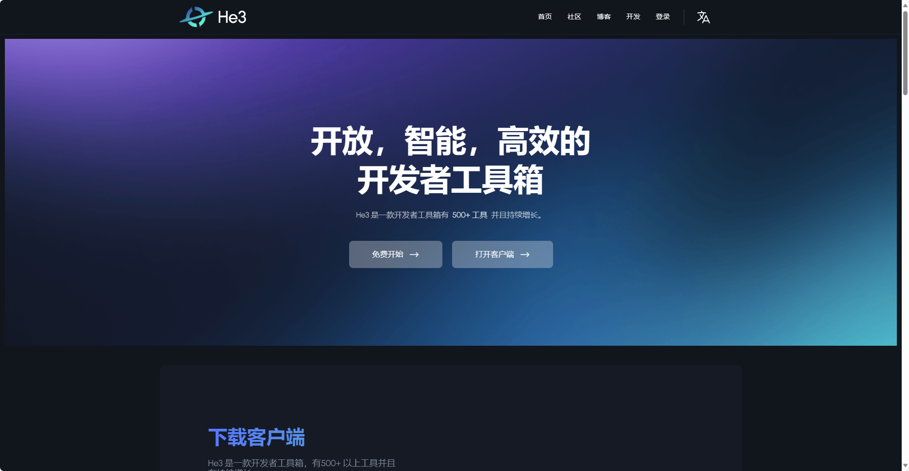

# 编程类软件工具

::: tip 资源持续更新中...
如果你有什么好的资源，可以在群里分享，后续被选中后会被录入  
点击右上角交流群加入群聊
:::

## 终端工具

#### [uTools - 你的生产力工具集 (u-tools.cn)](https://open.u-tools.cn/199327.html)

- uTools 是一个极简、插件化的现代桌面软件，通过自由选配丰富的插件，打造得心应手的工具集合
- 简单介绍其功能点：本地文件搜索，应用快速启动，[使用指南](https://u.tools/docs/guide/about-uTools.html#utools-%E6%98%AF%E4%BB%80%E4%B9%88)

## He3

[He3-开发者必备的万能工具箱](https://he3.app/zh/)

## shell 工具

[MobaXterm](https://mobaxterm.mobatek.net/)

- MobaXterm 是您**用于远程计算的终极工具箱**。
- 集**shell 操作**与**文件拖拽**一体的**免费终端工具**。**直观的用户界面**，以便您通过不同的网络或系统**有效地访问远程服务器**

[FinalShell](https://www.hostbuf.com/t/988.html)

- SSH工具,服务器管理,远程桌面加速软件,支持Windows,macOS,Linux,

## 内网穿透

[内网穿透](https://www.i996.me/)

## 破解工具

[JetBrain 全家桶激活](https://idea.medeming.com/1172.html)

## redis

[window 可视化 redis-client](https://github.com/qishibo/AnotherRedisDesktopManager/releases)

[windows redis-server](https://github.com/MicrosoftArchive/redis/releases)
